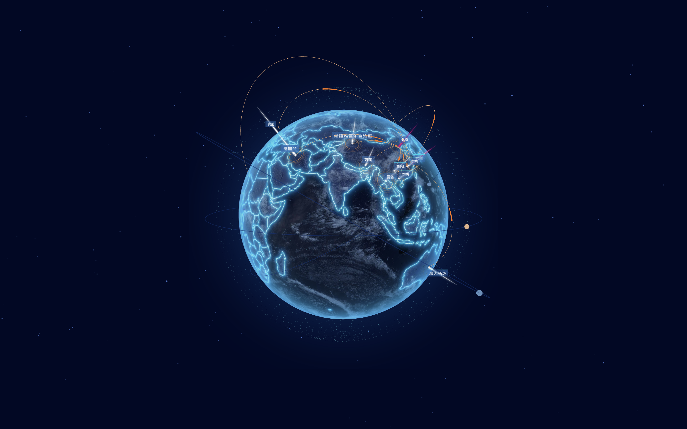

# 3d-earth
This project is built with [three-ts-webpack](https://github.com/GhostCatcg/three-ts-webpack)

[Live Demo](https://gcat.cc/demo/earth)

## Todolist
1. - [x] Loading effect [loading...]
2. - [x] Earth and starry background 🌏
3. - [x] Glow and atmosphere ✨
4. - [x] Earth markers and city labels 🇨🇳
5. - [x] Satellite orbit rotation 🛰
6. - [x] Flying lines between countries/cities 🪐
7. - [ ] Airplane flying along the flight path 🛫